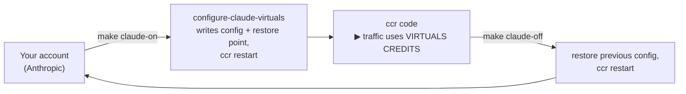
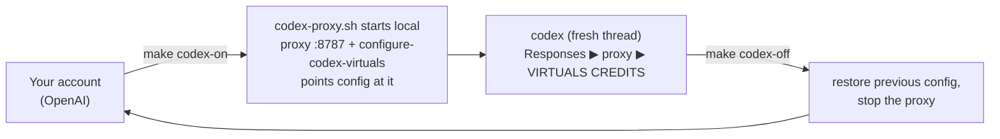

# Agent Setup

Use this repo as the canonical source for reusable ACP agent skills and local agent utilities.

## Skill Source Of Truth

Keep shared skills under `skills/` in this repo. Agent-specific setup should install or link those skills into each agent runtime:

- Codex reads reusable user skills from `~/.agents/skills/`.
- Claude Code reads reusable skills from `~/.claude/skills/`.

Shared contributed skills should be self-contained under `skills/<skill-name>/` with their `SKILL.md`, metadata, references, and validation examples. Project-specific Showcase skills can live with their project package under `showcase/<project-slug>/skills/<skill-name>/`.

Shared skill sources:

- [`skills/acp-builder-setup`](../skills/acp-builder-setup) - setup and routing guidance for Codex, Claude Code, and Claude Desktop.
- [`skills/acp-paid-subscription-checkout`](../skills/acp-paid-subscription-checkout) - live local checkout execution, desktop-safe handoff, and redacted evidence review.

Public GitHub references are listed in [`docs/skill-packages.md`](skill-packages.md).

This repo does not check in project-scope `.agents/skills` or `.claude/skills` aliases. The canonical source is `skills/`; builders install or symlink the skills they want into their local agent runtime.

For active development, prefer symlinks so local skill edits are picked up by both tools:

```bash
scripts/install-local-skills.sh --mode symlink --target both
```

For one-off local installs, copying is fine:

```bash
scripts/install-local-skills.sh --mode copy --target both
```

## Model Routing Utilities (optional — free Virtuals credits)

Routing your agent through Virtuals is **optional**. It lets you use
Virtuals-hosted models so inference is billed to **Virtuals credits instead of
your own account**. It is fully reversible.

> **Read this first.** When routing is **ON**, your Claude Code / Codex spends
> **Virtuals credits**, not your Anthropic/OpenAI account — even though it still
> looks like "your" Claude or Codex. Turning it **OFF** puts you back on your own
> account. The lifecycle below is just: turn **on → use → off**, with a **recover**
> path if anything goes wrong.

**New here?** For the step-by-step first-time runbook — prerequisites, the
commands in order — follow [`skills/acp-builder-setup/references/setup-commands.md`](../skills/acp-builder-setup/references/setup-commands.md).
This section explains how routing works and is the reference for recovery and
advanced use.

**What `VIRTUALS_API_KEY` is for.** It authenticates you to Virtuals' compute
endpoint (`https://compute.virtuals.io/v1`) — the service that runs the models and
draws down your credits. The router (Claude Code) and the local proxy (Codex)
don't validate it themselves; they just carry it on each upstream request. It is
read from your shell, not baked into any config file. Get one from
[app.virtuals.io](https://app.virtuals.io/).

To discover available model IDs and choose which model each agent uses, see [`docs/model-config.md`](model-config.md).

The simple path is the `make` lifecycle (run `make help` for all targets). It
wraps the scripts below and handles validation, the proxy, and `ccr` restarts for
you. Set `VIRTUALS_API_KEY` in your shell first.

### Three moving parts

Routing looks like three tools doing one thing. They are distinct:

| Part | What it is | Tool |
| --- | --- | --- |
| **Config switcher** | Edits your global config + saves a restore point | `make *-on/off` → `scripts/configure-*-virtuals.mjs` |
| **Proxy** (Codex only) | Translates Codex `/v1/responses` → Virtuals Chat Completions | `make codex-proxy` / `scripts/codex-proxy.sh` |
| **Agent runtime** | What actually sends your traffic | `ccr code` / `codex` |

Codex needs the proxy because its custom providers call `/v1/responses`; Claude
Code calls Anthropic-compatible `/v1/messages` and is routed by `claude-code-router`.

### Claude Code lifecycle



```bash
make claude-on      # activate Virtuals routing, validate, restart ccr
ccr code            # use Claude Code on Virtuals credits
make claude-check   # (read-only) validate the active router config
make claude-off     # back to your own account
```

### Codex lifecycle



```bash
make codex-on       # start the local proxy (background) + point Codex at it
codex               # start a FRESH thread so it picks up the new provider
make codex-off      # back to your own account (also stops the proxy)
make codex-proxy    # alt: run the proxy in the foreground to watch logs
```

### Advanced: call the scripts directly

The `make` targets wrap `scripts/configure-codex-virtuals.mjs` and
`scripts/configure-claude-virtuals.mjs`. Use the scripts directly for a
non-default model or manual recovery. Both support
`virtuals | restore | default | check`:

```bash
scripts/configure-codex-virtuals.mjs restore               # previous Codex model/provider
scripts/configure-codex-virtuals.mjs default               # built-in Codex routing (no restore state)

scripts/configure-claude-virtuals.mjs restore && ccr restart   # previous provider/routes
scripts/configure-claude-virtuals.mjs default && ccr restart   # remove Virtuals routes
scripts/configure-claude-virtuals.mjs check                    # validate active config
```

Keep shared utilities in `utilities/` so setup docs, skills, and examples evolve together.

### Recover: getting your original config back

`restore` reverts to the config from just before the most recent activation; if that snapshot is gone, it automatically falls back to a one-time baseline the first activation saved next to your config:

- Claude Code: `~/.claude-code-router/config.json.before-virtuals.bak`
- Codex: `~/.codex/config.toml.before-virtuals.bak`

You normally never touch these. If you can't run `restore`, or you want the exact frozen original back, copy the baseline in by hand:

```bash
cp ~/.claude-code-router/config.json.before-virtuals.bak ~/.claude-code-router/config.json && ccr restart
# Codex: cp ~/.codex/config.toml.before-virtuals.bak ~/.codex/config.toml, then start a fresh thread
```

## Desktop Support Matrix

| Surface | Skills from this repo | Virtuals routing utility | Status |
| --- | --- | --- | --- |
| Codex CLI | Yes, via explicit install or symlink to `~/.agents/skills` | Yes, via `utilities/model-routing/codex-virtuals-proxy` and `~/.codex/config.toml` | Supported |
| Codex Desktop app | Yes, Codex app loads the same Codex skill system | Yes, Codex app uses the same local agent configuration layers as CLI/IDE | Supported for local threads when the proxy is running |
| Claude Code terminal | Yes, via explicit install or symlink to `~/.claude/skills` | Yes, via `utilities/model-routing/claude-virtuals-router` and `ccr code` | Supported |
| Claude Desktop app | Yes, for uploadable ZIP packages in `packages/claude-desktop`; not from `~/.claude/skills` | Not via `claude-code-router`; Desktop does not use `ccr code` | Supported for setup, handoff, and evidence review |

### Claude Desktop Notes

Claude Desktop has its own skills surface through Claude settings. Upload the zipped packages in [`packages/claude-desktop`](../packages/claude-desktop) for account-level use. This is separate from Claude Code's local filesystem skills.

The combined ACP checkout skill selects handoff or evidence-review mode in Claude Desktop. It must not issue cards, retrieve OTPs, enter payment details, or click paid checkout buttons unless those local capabilities are available through a dedicated MCP server or Desktop extension. Run live checkout execution in Codex CLI/Desktop local thread or Claude Code.

`claude-code-router` is a Claude Code terminal integration. It starts Claude Code with local environment overrides and a local `/v1/messages` router. Claude Desktop will not automatically inherit that router config.
